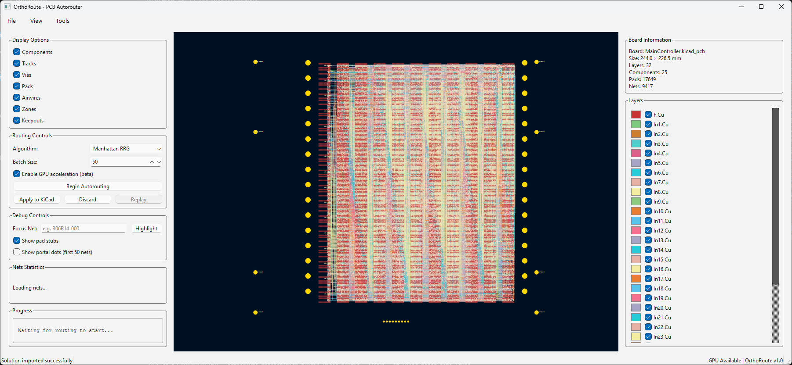
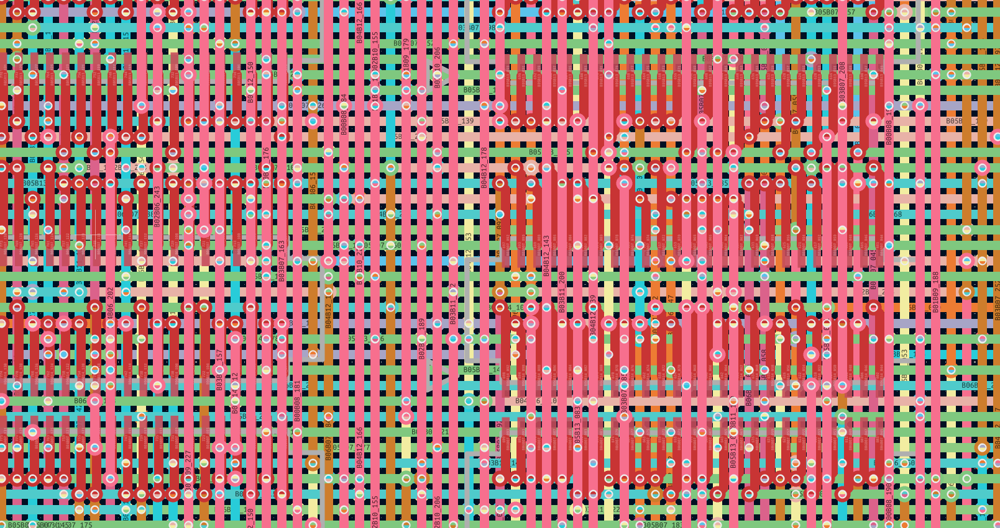
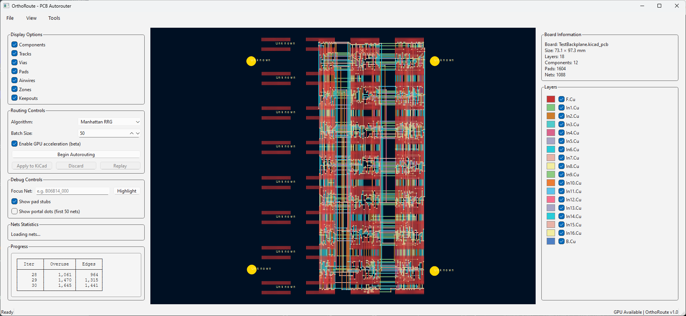
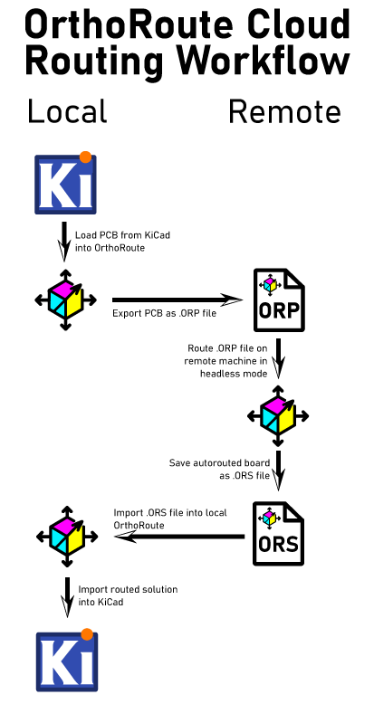

<table width="100%">
  <tr>
    <td align="center" width="300">
      
    </td>
    <td align="left">
      <h2>OrthoRoute - GPU Accelerated Autorouting for KiCad</h2>
      <p><strong>OrthoRoute is a GPU-accelerated PCB autorouter that uses a Manhattan lattice and the PathFinder algorithm to route high-density boards. Built as a KiCad plugin, it handles complex designs with thousands of nets that make traditional push-and-shove routers give up.</strong></p>
      <p><em>Orthogonal! Non-trivial! Runs on GPUs! I live in San Francisco!</em></p>
      <p><em>Never trust the autorouter, but at least this one is fast. </em></p>
    </td>
  </tr>
</table>

> [!CAUTION]
> **OrthoRoute is not a general-purpose PCB autorouter.**
>
> OrthoRoute is designed for a narrow class of extremely large, dense, highly
> regular multilayer backplanes and BGA escape patterns. It is useful to about
> five people on the planet, and you probably aren't one of them. For a 
> conventional PCB, use something else.
>
> In *[PCBWorld: A Benchmark Environment for Engine-Grounded PCB Design
> Automation](https://arxiv.org/abs/2607.05915)*, Song et al. benchmarked
> OrthoRoute against Freerouting, KiCadRoutingTools, and several learned routing
> agents on synthetic and open-source PCB datasets.[^pcbworld]
>
> * On the synthetic D2 dataset, OrthoRoute achieved a **1% clean-pass rate**
>   and **30% routability**.
> * On D3-A, a set of 99 open-source boards, it achieved a **2% clean-pass
>   rate** and **51% routability**.
> * Freerouting and KiCadRoutingTools performed dramatically better on both
>   datasets.
>
> The benchmark used small, ordinary boards and OrthoRoute's upstream defaults;
> it did not test OrthoRoute's intended thousands-net backplane workload. It
> nevertheless demonstrates that OrthoRoute is a terrible default choice for
> ordinary PCB autorouting.

[^pcbworld]: Hyungseok Song et al., “[PCBWorld: A Benchmark Environment for
Engine-Grounded PCB Design Automation](https://arxiv.org/abs/2607.05915),”
*arXiv preprint* arXiv:2607.05915, 2026, Table 3 and Appendix K.5.

A much more comprehensive explanation of the _WHY_ and _HOW_ of this repository is available on the [build log for this project](https://bbenchoff.github.io/pages/OrthoRoute.html).

## Videos

<table>
  <tr>
    <td align="center" width="33%">
      <a href="https://www.youtube.com/watch?v=KXxxNQPTagA">
        
        <br/>
        <b>OrthoRoute Overview</b>
      </a>
    </td>
    <td align="center" width="33%">
      <a href="https://www.youtube.com/watch?v=P8Wsej71XAQ">
        
        <br/>
        <b>Algorithm Demonstration</b>
      </a>
    </td>
    <td align="center" width="33%">
      <a href="https://www.youtube.com/watch?v=j_XJNxEXXkQ">
        
        <br/>
        <b>PathFinder Net Tour</b>
      </a>
    </td>
  </tr>
</table>

## What Is Orthoroute?

OrthoRoute is a KiCad autorouter for _exceptionally large_ or _very complex_ backplane designs and BGA escape patterns. The simplified idea behind this algorithm is, "put all your parts on the top layer, and on layers below that, create a grid of traces. Only horizontal traces on layer 1, only vertical traces on layer 2, and continue like that for all the other layers. Route through this 'Manhattan grid' of traces with blind and buried vias".

The algorithm used for this autorouter is [PathFinder: a negotiation-based performance-driven router for FPGAs](https://dl.acm.org/doi/10.1145/201310.201328). My implementation of PathFinder treats the PCB as a graph: nodes are intersections on an x–y grid where vias can go, and edges are the segments between intersections where copper traces can run. Each edge and node is treated as a shared resource.

PathFinder is iterative. In the first iteration, all nets (airwires) are routed _greedily_, without accounting for overuse of nodes or edges. Subsequent iterations account for congestion, increasing the “cost” of overused edges and ripping up the worst offenders to re-route them. Over time, the algorithm _converges_ to a PCB layout where no edge or node is over-subscribed by multiple nets.

With this architecture -- the PathFinder algorithm on a very large graph, within the same order of magnitude of the largest FPGAs -- it makes sense to run the algorithm with GPU acceleration. There are a few factors that went into this decision:

1. Everyone who's routing giant backplanes probably has a gaming PC. Or you can rent a GPU from whatever company is advertising on MUNI bus stops this month.
2. The PathFinder algorithm requires hundreds of billions of calculations for every iteration, making single-core CPU computation glacially slow. 
3. With CUDA, I can implement a SSSP (parallel Dijkstra) to find a path through a weighted graph very fast. 

Note this is _not_ a fully parallel autorouter; in OrthoRoute, nets are still routed in sequence on a shared congestion map. The parallelism lives inside the shortest-path search: a CUDA SSSP (“parallel Dijkstra”) kernel makes each individual net’s pathfinding fast, but it doesn’t route many nets simultaneously.

## Features

- KiCad Integration: Built as a native KiCad plugin using the IPC API
- GPU-Accelerated Routing: Uses CUDA/CuPy or Apple Silicon/Metal
- Manhattan Routing: Specialized for orthogonal routing patterns (horizontal/vertical layer pairs)
- Real-time Visualization: Interactive 2D board view with zoom, pan, and layer controls
- Checkpoint system for instant resume after crashes (experimental)
- Headless (Cloud) Routing: Rent an A100 GPU in some datacenter

## Screenshots

### Main Interface

<div align="center">
  
  <br>
  <em>OrthoRoute plugin showing a successful Manhattan route</em>
</div>

<div align="center">
  
  <br>
  <em>A view of what the 'Manhattan Lattice' looks like in KiCad</em>
</div>

<div align="center">
  
  <br>
  <em>OrthoRoute plugin showing a successful Manhattan route</em>
</div>

## Quick Start

### Prerequisites
- **KiCad 10.0+** with the API server enabled under Preferences → Plugins
- An NVIDIA CUDA 12 GPU on Windows/Linux, or Apple Silicon on macOS
- Enough accelerator memory for the board and routing grid

### Installation Methods

#### Install the KiCad package

1. Download
   [`OrthoRoute-1.0.0-KiCad-PCM.zip`](https://github.com/bbenchoff/OrthoRoute/releases/download/v1.0.0/OrthoRoute-1.0.0-KiCad-PCM.zip),
   or build it from source using the instructions below.
2. In KiCad 10, open **Plugin and Content Manager** and choose
   **Install from File...**.
3. Select the OrthoRoute PCM ZIP.
4. Enable the API server under **Preferences > Plugins**.
5. Restart PCB Editor and allow several minutes for KiCad to create
   OrthoRoute's isolated Python environment and install its dependencies.
6. Open a board and launch **OrthoRoute** from
   **Tools > External Plugins**.

#### Build the package from source

Clone the repository and run the package builder:

```bash
git clone https://github.com/bbenchoff/OrthoRoute.git
cd OrthoRoute
python build.py
```

The builder creates:

- `build/OrthoRoute-1.0.0-KiCad-PCM.zip` for KiCad 10's
  **Install from File...** command
- `build/OrthoRoute-1.0.0-KiCad-IPC.zip` for manual native-plugin installation

Developers can build and deploy directly into their newest local KiCad
installation:

```bash
python build.py --deploy
```

Use `python build.py --deploy --kicad-version 10.0` to target KiCad 10
explicitly. Standalone development remains available with `python main.py`.

## Will it work with _my_ GPU?

As long as you have an NVIDIA card or Apple Silicon, yeah, probably. If it doesn't run on your card/computer, [open a new issue](https://github.com/bbenchoff/OrthoRoute/issues).

**Important distinction:**
- **VRAM usage** is determined by board dimensions, layers, and grid pitch (not net count)
- **Routing time** is determined by number of nets
- Example: 500 nets vs 8,000 nets on the same 200×200mm 20-layer board uses the **same VRAM** but takes **16x longer** to route

**If you get "Out of Memory" errors:** Rent a GPU with more VRAM or use `--cpu-only` mode (slower but no memory limit).

## Usage

### GUI Mode (Recommended)
1. **Open your PCB** in KiCad 10.0+ with the API server enabled
2. **Launch OrthoRoute** from the PCB Editor toolbar
3. **Route your nets** - OrthoRoute will automatically:
   - Extract board data via KiCad IPC API
   - Build 3D routing lattice (multi-layer Manhattan routing)
   - Map pads to routing graph
   - Route nets using GPU-accelerated PathFinder
5. **Monitor progress** in the interactive PCB viewer
6. **Review results** - tracks and vias are automatically added to KiCad

### Standalone Mode (For Testing)
```bash
# Built-in acceptance test (synthetic board routing)
python main.py --test-manhattan

# Run regression tests
pytest tests/                                    # All tests (unit + regression)
pytest tests/regression/test_backplane.py -v    # Full regression suite (63 tests)
pytest tests/unit/ -v                           # Unit tests only (167 tests)
```

**Note:** CLI mode (`python main.py cli board.kicad_pcb`) is designed for development/debugging and requires KiCad to be running with the board open in PCB Editor.

### Cloud (Headless, Kicad-less) Mode
Headless mode is designed for instances when you would like to route a board, but it won't fit in your GPU. This mode is actually several functions that allow for running a routing algorithm _without KiCad_.

<div align="center">
  
  <br>
  <em>Cloud routing workflow for running OrthoRoute on remote GPU instances</em>
  <br>
</div>

The workflow is three steps. First, export the PCB from the OrthoRoute plugin
1. Load a PCB in KiCad
2. Run the OrthoRoute plugin
3. Select `File -> Export PCB...` from the top menu
4. Save this file (with `.ORP` extension) to disk

Second, run OrthoRoute using the saved `.ORP` file:
  ```bash
  python main.py headless <your-board>.ORP

    Optional parameters:
  python main.py headless <board>.ORP --max-iterations 200    # Set max iterations (default: 200)
  python main.py headless <board>.ORP -o custom.ORS           # Specify output filename
  python main.py headless <board>.ORP --use-gpu               # Force GPU mode
  python main.py headless <board>.ORP --cpu-only              # Force CPU-only mode
  ```

Third, import the routing solution back into KiCad:
1. In the OrthoRoute plugin, select `File -> Import Solution...` (or press Ctrl+I)
2. Select the generated `.ORS` file
3. Review the routing in the preview window
4. Click "Apply to KiCad" to commit the traces and vias to your PCB

Typical use case: Cloud GPU routing

Upload your .ORP file to a cloud GPU instance (Vast.ai, RunPod, etc.), run the routing there, then download the .ORS file back to your local machine for import. This allows routing large boards on powerful GPUs with more memory. Details on the file format are available [in the docs](docs/ORP_ORS_file_formats.md)

### Debug Mode & Logging

By default OrthoRoute runs in **normal mode** — minimal log output, no iteration screenshots:

| Behaviour | Normal mode (default) | Debug mode (`ORTHO_DEBUG=1`) |
|---|---|---|
| Log file level | `WARNING` only (~66 milestone lines/run) | `DEBUG` (full detail) |
| Iteration screenshots | Disabled | Saved to `debug_output/` at 8× resolution |
| Screenshot frequency | — | Every N iterations (`ORTHO_SCREENSHOT_FREQ`) |
| Screenshot scale | — | 8× default (`ORTHO_SCREENSHOT_SCALE`) |

**Enable debug mode before launching KiCad (PowerShell):**
```powershell
$env:ORTHO_DEBUG = '1'
start kicad          # or however you launch KiCad
```

**Fine-tune screenshot output:**
```powershell
$env:ORTHO_DEBUG             = '1'   # master switch
$env:ORTHO_SCREENSHOT_FREQ   = '5'   # screenshot every 5 iterations
$env:ORTHO_SCREENSHOT_SCALE  = '4'   # 4× resolution instead of 8×
```

**Disable again:**
```powershell
Remove-Item Env:ORTHO_DEBUG
```

Log files are always written to `<plugin_dir>/logs/` regardless of mode.

##  Contributing

Please see [`docs/contributing.md`](docs/contributing.md) for guidelines.

If something's not working or you just don't like it, first please complain. Complaining about free stuff will actually force me to fix it. I would especially like to hear from you if you think it sucks.

## License

This project is licensed under the MIT License - see the [LICENSE](LICENSE) file for details.

## Acknowledgments

- KiCad development team for the excellent IPC API
- NVIDIA for CUDA/CuPy GPU acceleration support
- The open-source PCB design community

- **Issues**: [GitHub Issues](https://github.com/bbenchoff/OrthoRoute/issues)
- **Discussions**: [GitHub Discussions](https://github.com/bbenchoff/OrthoRoute/discussions)
- **Documentation**: [Project Wiki](https://github.com/bbenchoff/OrthoRoute/wiki)

---
